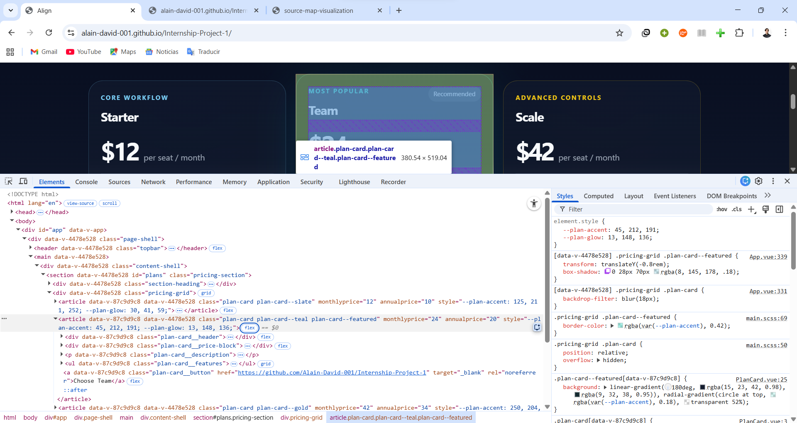

# Task 2 Report

## 2.1 Selected Element

The selected element is the second pricing card in the plans grid: the featured **Team** card.
In the DOM, this is the `<article>` element with the classes `plan-card plan-card--teal plan-card--featured`.

I chose this element because its final appearance is not defined by a single CSS rule or source file.
Instead, the computed styles come from several layers working together:

- scoped SCSS inside `src/components/PlanCard.vue`
- `:deep(...)` selectors inside `src/App.vue`
- global SCSS inside `src/styles/main.scss`
- inline CSS custom properties set from Vue in `PlanCard.vue` (`--plan-accent` and `--plan-glow`)
- state-dependent rules such as `:hover`
- generated scoped selectors added by Vue (`[data-v-...]`)

This makes the Team card a good candidate for the investigation, because it shows how the browser combines authored SCSS, generated selectors, inline variables, and override rules before producing the final computed result shown in Chrome DevTools.

Figure 1. Chrome DevTools inspecting the featured Team card and its matched style sources.

## 2.2 Property Analysis

Unless stated otherwise, the following checks were done on the featured Team card at desktop width and without forcing the `:hover` state.
For rules coming from Vue single-file components, the line numbers reported by Chrome source maps are relative to the extracted `<style>` source rather than the full `.vue` file on disk.
I recorded those DevTools-reported coordinates as shown below and discuss this limitation further in section 2.3.

### 2.2.1 Worked Example: `transform`

I started with the `transform` property.
In the Computed panel, Chrome showed the computed value as `matrix(1, 0, 0, 1, 0, -12.8)`.
Clicking the arrow next to the computed value highlighted the corresponding rule in the Styles panel:

`[data-v-4478e528] .pricing-grid .plan-card--featured { transform: translateY(-0.8rem); }`

Figure 2. Clicking the computed `transform` value highlights the corresponding rule in the Styles panel and links it to `App.vue`.

One useful detail is that, with CSS source maps enabled, Chrome linked this rule directly to the authored source in `App.vue`.
That is convenient for debugging, but it skips over the generated CSS location that the task also asks for.

To capture the generated CSS position, I temporarily opened the Command Menu with `Ctrl+Shift+P` and ran `Disable CSS source maps`.
After disabling CSS source maps, Chrome linked the same rule to `main.css:2`.

Figure 3. After disabling CSS source maps, Chrome links the `transform` rule to the generated stylesheet `main.css:2`.

Clicking that link opened the generated stylesheet in the Sources panel and placed the cursor at the exact generated declaration: line 2, column 6147.
Even though the file was emitted in minified form, Chrome displayed it in a readable pretty-printed view, which made the generated position much easier to inspect.

Figure 4. Chrome opens the generated stylesheet and positions the cursor at the `transform` declaration in `main.css`.

I then re-enabled CSS source maps with the corresponding command.
Once CSS source maps were enabled again, Chrome linked the rule back to the authored source in `App.vue`, line 339, column 3.
This completed the full trace from the computed value, to the generated CSS, and finally back to the original SCSS source.

Figure 5. After re-enabling CSS source maps, Chrome links the `transform` rule back to its authored source in `App.vue`.

As an additional check, I also used a source-map visualization tool with `main.css` and `main.css.map`.
It independently mapped the generated `transform: translateY(-0.8rem)` segment back to the same authored rule in `App.vue`.

Figure 6. The source-map visualization tool independently maps the generated `transform` declaration back to the authored rule in `App.vue`.

**Result for `transform`**

- Computed value: `matrix(1, 0, 0, 1, 0, -12.8)`
- Matching rule in Styles: `[data-v-4478e528] .pricing-grid .plan-card--featured { transform: translateY(-0.8rem); }`
- Generated CSS location: `dist/css/main.css`, line 2, column 6147
- Authored source via source maps: `src/App.vue`, line 339, column 3

### 2.2.2 Summary of the Remaining Properties

The same tracing workflow was repeated for four additional properties.
The results are summarized below.

| Property | Computed Value in DevTools | Matching Rule in Styles | Generated CSS Location | Authored Source via Source Maps | Note |
| --- | --- | --- | --- | --- | --- |
| `backdrop-filter` | `blur(18px)` | `[data-v-4478e528] .pricing-grid .plan-card { backdrop-filter: blur(18px); }` | `dist/css/main.css`, line 2, column 5999 | `src/App.vue`, line 331, column 3 | This value comes from a `:deep(...)` rule in `App.vue`. |
| `border-color` | All four sides resolve to `rgba(45, 212, 191, 0.42)` | `.pricing-grid .plan-card--featured { border-color: rgba(var(--plan-accent), 0.42); }` | `dist/css/main.css`, line 3, column 945 | `src/styles/main.scss`, line 69, column 5 | The final color depends on the inline custom property `--plan-accent: 45, 212, 191`. |
| `box-shadow` | `0 28px 70px rgba(8, 145, 178, 0.18)` | `[data-v-4478e528] .pricing-grid .plan-card--featured { box-shadow: 0 28px 70px rgba(8, 145, 178, 0.18); }` | `dist/css/main.css`, line 2, column 6177 | `src/App.vue`, line 340, column 3 | This property is generated by the same featured-card rule as `transform`. |
| `background-image` | `linear-gradient(180deg, rgba(15, 23, 42, 0.98), rgba(9, 32, 38, 0.95)), radial-gradient(circle at top, rgba(45, 212, 191, 0.18), transparent 52%)` | `.plan-card--featured[data-v-87c9d9c8] { background: linear-gradient(...), radial-gradient(...); }` | `dist/css/main.css`, line 1, column 611 | `PlanCard.vue`, line 25, column 5 | The computed `background-image` comes from the authored `background` shorthand and also depends on `--plan-accent`. |

## 2.3 Cases Where Mapping Becomes Ambiguous

### Case 1: Chrome exposes rule-level links, not property-level navigation

The most important limitation I observed is that Chrome DevTools links the inspected style back to the source rule, but not reliably to the exact declaration inside that rule.
In practice, clicking a property such as `background-image` or `font-weight` opened the correct source file, but I still had to scan within the rule to find the specific property.

This is significant because the emitted source map itself contains more precise information than the DevTools UI exposes.
I verified this with the source-map visualization tool, which highlights the exact generated segment and its matching segment in the original source.

Figure 7. The source-map visualization tool exposes declaration-level mappings that are more precise than the rule-level navigation Chrome presents in DevTools.

So the ambiguity is not necessarily in the source map data.
It is in the browser-facing navigation layer, which operates closer to "this rule came from here" than "this exact property/value came from here."
For a WebStorm prototype, this means DevTools-originated navigation may still be only best-effort at declaration level.

### Case 2: Vue single-file component coordinates are relative to the extracted style block

For rules that came from scoped styles in `App.vue` or `PlanCard.vue`, the source-mapped line numbers were not the real line numbers in the full single-file component on disk.
They were line numbers inside the extracted `<style>` content.

For example:

- the featured-card `transform` maps to `App.vue` line 339 through the CSS source map, but in the full file the declaration is around line 564

Figure 8. Chrome reports the featured-card `transform` rule at `App.vue` line 339 because the CSS source map points to the extracted `<style>` content.

Figure 9. In the full single-file component on disk, the same rule appears much later, around line 564.

So the map answers "where is this in the virtual stylesheet produced from the component?" rather than "where is this in the full `.vue` file as opened in an editor?"
That is a real integration problem for IDE navigation, because an editor needs full-file coordinates.
Recovering those positions would require Vue-specific knowledge in addition to the CSS source map itself.

### Case 3: Some computed values depend on runtime data outside CSS source maps

For several properties on the Team card, navigating to the stylesheet rule still does not fully explain the final value.
`border-color`, `background-image`, and other accent-based styles depend on `var(--plan-accent)` or `var(--plan-glow)`.

Those custom properties are not authored in a stylesheet.
They are attached to the `<article>` element at runtime through Vue:

- the root element in `PlanCard.vue` uses `:style="cardStyle"`
- `cardStyle` returns `--plan-accent` and `--plan-glow`
- those values come from the `toneMap` object in the script block

So the trace breaks across a boundary:

1. computed value in DevTools
2. matching CSS declaration in generated/authored CSS
3. `var(--plan-accent)` or `var(--plan-glow)`
4. inline style on the DOM element
5. Vue script code that produced that inline style

At that point, CSS source maps are no longer enough on their own.
They can tell us where the stylesheet rule came from, but not where the runtime custom property value was defined.
